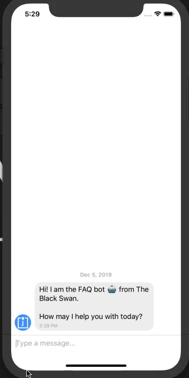

# DialogflowWithReactNative-
A React Native project with implementation of Chat Bot Feature for Android and iOS both using Dialog Flow.

### Screenshots



## Prerequiestes
* Node v8.3+
* Npm v5.0+
* Watchman v4.0+
* Xcode v9.3+
* Android SDK
* Java Development Kit (v8 or newer)

## Getting Started

You can download this repo or clone using below command. (folder-name will be project folder in which you want to start your project).
```
git clone <REPO URL> <folder-name>
```
or from **Download Zip**
```
<REPO URL>
```

## Installing Dependencies

Install it once globally:
```
> npm install -g react-native-cli   (install the React Native command line interface)
```
Now go to project folder and run this command:
```
> npm install     (this will install all node dependencies)
```

## Project Run

Now go to project folder and run this command:

### For iOS (Device or simulator)

```
> react-native run-ios
```

### For Android (Device or simulator)

```
> react-native run-android
```

### NOTE

- This project is still under development.

# Pull Requests

I welcome and encourage all pull requests. It usually will take me within 24-48 hours to respond to any issue or request. Here are some basic rules to follow to ensure timely addition of your request:

1.  Match coding style (braces, spacing, etc.) This is best achieved using `Reformat Code` feature of Android Studio `CMD`+`Option`+`L` on Mac and `CTRL` + `ALT` + `L` on Linux + Windows .
2.  If its a feature, bugfix, or anything please only change code to what you specify.
3.  Please keep PR titles easy to read and descriptive of changes, this will make them easier to merge :)
4.  Pull requests _must_ be made against `develop` branch. Any other branch (unless specified by the maintainers) will get rejected.
5.  Check for existing [issues](https://github.com/JadavChirag/DialogflowWithReactNative-/issues) first, before filing an issue.
6.  Make sure you follow the set standard as all other projects in this repo do
7.  Have fun!

### Created & Maintained By

[Jadav Chirag](https://github.com/JadavChirag) ([@JadavRadhe](https://www.twitter.com/JadavRadhe)) ([YouTube](https://www.youtube.com/channel/UCFZa4oPejfav-slLhApw_ag))
([Insta](https://www.instagram.com/jadavchirag2864))


# License

    Copyright 2019 Jadav Chirag

    Licensed under the Apache License, Version 2.0 (the "License");
    you may not use this file except in compliance with the License.
    You may obtain a copy of the License at

       http://www.apache.org/licenses/LICENSE-2.0

    Unless required by applicable law or agreed to in writing, software
    distributed under the License is distributed on an "AS IS" BASIS,
    WITHOUT WARRANTIES OR CONDITIONS OF ANY KIND, either express or implied.
    See the License for the specific language governing permissions and
    limitations under the License.

## Getting Started

For help getting started with React Native and Dialog Flow, view our online
[documentation](https://dialogflow.com/).
